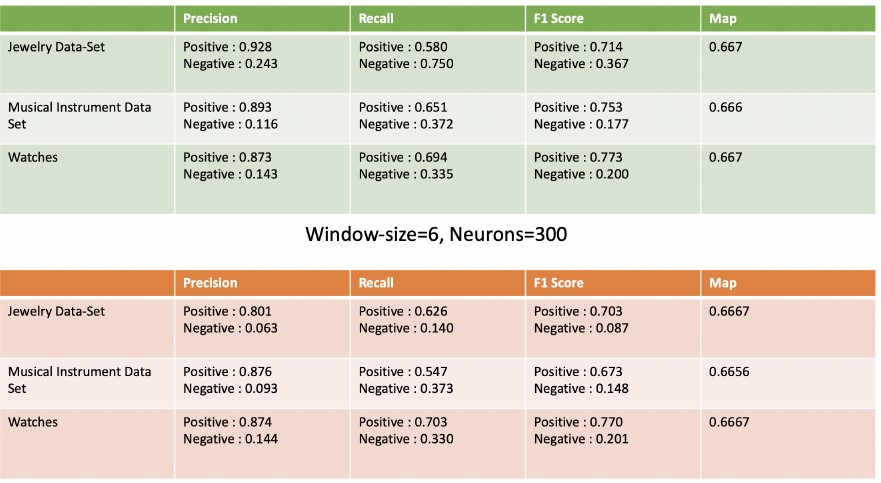

# Review Based Recomendation System
With billions of products on Amazon and hundreds to thousands of reviews on average for each, it becomes confusing
to choose a product. To add an extra layer of confusion, now a days, Businesses and sellers get people to write positive
reviews and give better star ratings. Thus, it becomes hard for an average person to choose between products. This is
where a review-based recommendation system would strive to aid in the struggle a lot.
A set of reviews from Amazon’s data set have been analysed here to construct a recommendation system. In general, product
recommendation system work on popularity based on ratings. This has many shortcomings. In our approach we try to construct a
system that takes into account, the popularity based on review, rating and time. Several Models on different data-sets with multiple
configurations were trained and a model with better evaluation metrics was chosen as the “better” recommendation system.

# Proposed Approach

The approach, put forward in this project along with formal terminologies, can be elucidated in multiple steps,

The first and the most common step is to pre-process the Data-sets. This involved feature selection that was handcurated,
handling missing values, which in this case was not that much of a hassle as the proportion of missing values
was infinitesimal, so just dropping the missing values was enough. Then, selecting observations of unique products
that are adequate enough for the model to learn unbiased parameters and dropping those products for which there are
not enough number of observations (the threshold set here is 100). Moreover, Feature Engineering of variables such as
’ratio_votes’ based on helpful total_votes, ’True_value’ based on ’star_rating’ and ’predicted_value’ based on 'score' 

The second stage of the approach comprises of tokenizing the review_body where all of the reviews had to go
through a function that cleans the text, converts them to standard ASCII values using ’unidecode()’ function, turns all the text into lower-case, gets rid of numbers, removes stop words using gensim.utils[5] package’s simple pre-process function and eliminates words that have no semantic meaning based on the corpus available in "nltk library".

Third and the most important step, that is the model training, where the models were trained on individual data-sets of the three chosen for-trial-purposes, which can then be used for generic implementation. To train each model, first a basic model object from gensim.models[4] is created using the "Word2Vec()" function, where certain parameters are to be specified such as learning rates, window size, number of neurons in hidden layers, minimum frequency of the words, thread-workers and many more. Then, the tokenized reviews are passed to the "build_vocab()" function that is callable by model object that was initialized in the first step. This returns a corpus of unique words, set of words across all the reviews in that data-set. Further, the model is trained by passing the processed reviews (tokenized reviews) to the train() function, that is again callable by the model object that was initialized in the first step, which now also contains
the vocabulary of the reviews of the data-set. Post training, the model-object consists of the word-embedding, 300 component vectors (1x300) for each of the word in model’s vocabulary, which is numerical representation of each word.

In the fourth step, the vector-representation of words or the word-embedding are passed to the ’KMeans’ model from
sklearn.cluster[6], which segregates them into two clusters and determines the centroid of positive and negative cluster.

In the fifth step, class of each word is determined in the user-built function ’class_determination’, passing the
centroids produced by the ’KMeans’ and ’Word2Vec’ model itself. Distance of each word from both the centroids is
calculated using the in-built function ’wv.similar_by_vector’, wherein cluster point (the positive and negative centroids)
is passed and topn value is gives values in increasing order of number of words and their distances to cluster center
specified. Based on the distance of each word to both the cluster centroids, the word is assigned to a class that it is
closest to.
Once the connotation (class) of the words are determined, that is whether it emits a negative or positive sentiment
(represented by -1 or 1), the score of each review is a total summation of negative and positive words, where
positive score indicates a good review, bad review otherwise. The results are contrasted with ratings given by the user to
that product, with the notion that low ratings will never go with a good review, meaning if the products were rated less indicates
the users didn’t like a certain product, hence the generalization is that that product will be given a negative review.

In the Final step, a query from the user is taken as input, and based on the category queried by the user, the
data-frame containing the pre-calculated scores is picked. The chosen data-frame is scanned for the most recent and
top-n (n being the number of reviews for a unique product) scores grouped by unique products, which is averaged. The
final output is the top-k (k being the number of unique products) products based on the averages

# Experimentation:
- window-size: number of words used for predicting the current word (n words on both sides).
- hidden layer size: number of neurons in hidden layer, that determines the dimensions of word-embeddings.
- Hyper-parameter Tuning: There are two main parameters that played an important role in affecting the performance
of the trained models, mainly window size and number of neurons in hidden layer. Smaller window size
(<=4) with 150 to 200 neurons in hidden layer and Larger window size (>=7) with same number of neurons evinced
low performance. After trying multiple combinations, the final set of parameters contained window size of 10 and 300
neurons in the hidden layer showed the best results.

One such scenario of contrast is presented below (window-size of 10 and 300 neurons VS window-size of 6 and 300
neurons) There was an instability observed in Word2Vec, that upon training model on same blend of parameters, slightly different results were obtained

# Results
The end-result for the project was the calculated connotation scores based on the sentiment of words derived from
their contextual surroundings. If the connotation score is positive and the star-rating is above the set threshold (which
is 3), then the prediction of connotation score is set to true, indicating the product was rated high and liked by the user,
therefore giving positive feedback. If the results are in opposite direction, ’low rating with positive connotation scores’
or ’high rating with negative connotation scores’, then the prediction is false. The precision, recall, f1 score and MAP
for the data-sets taken into consideration are as follows

The below figure of metrics depicts the difference of the same set of parameter combination as mentioned in Hyperparameter
Tuning. The model with window size 6 and 300 neurons has better precision, recall and F1 score than the model with window size 10 and 300 neurons. Whereas, the Mean Absolute Percentage Error for both the Combinations
are almost same for both the combinations.

